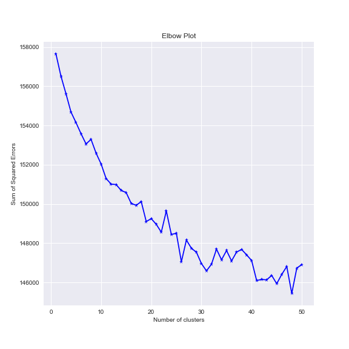
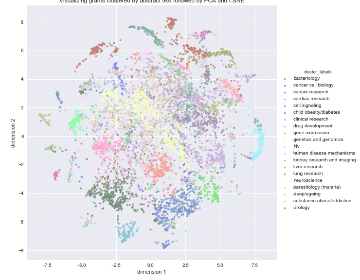
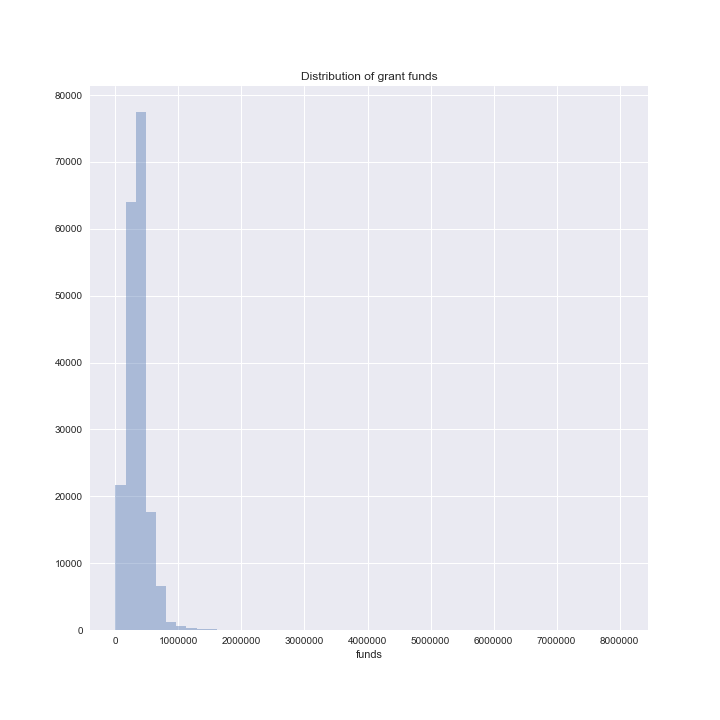
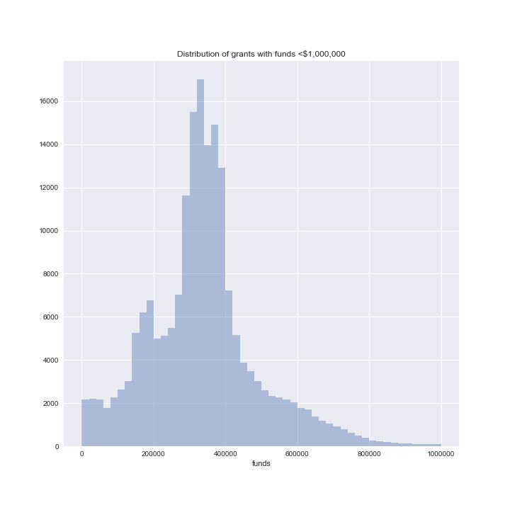
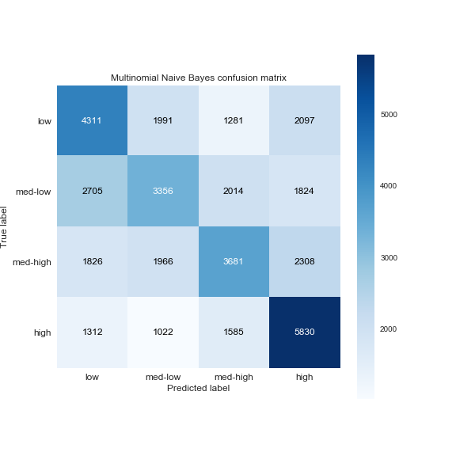
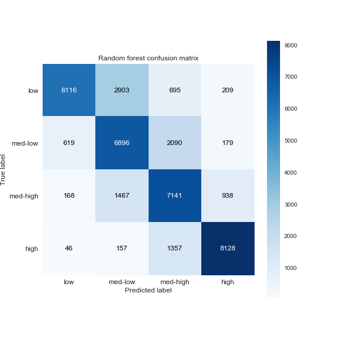
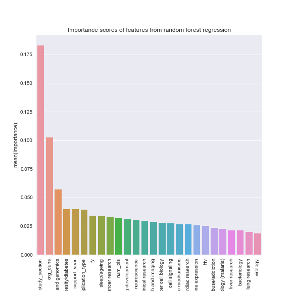

# Predicting amount of funding the NIH awarded research grants (R01s)

The National Institutes of Health (NIH) awards funds to grants related to public health research, and [comprehensive](https://github.com/yuwie10/nih-awards/blob/master/column-info/grant_col_info_all.csv) [information](https://github.com/yuwie10/nih-awards/blob/master/column-info/app_types.csv) regarding these grants funded by the NIH is publicly available and can be downloaded from [here](https://exporter.nih.gov/ExPORTER_Catalog.aspx). Ultimately we want to determine the likelihood a grant receives a certain amount of money, given the NIH decided to fund the proposal (the NIH is not required to publish data on proposals that are rejected). In today's highly competitive funding environment this information could be relevant to those submitting grant proposals. Our analysis will be limited to R01 grants, which are the major grants that fund research labs. The notebooks containing the full analysis are listed as follows:

1. Downloading and cleaning [grant](download-clean-data.ipynb) and [principal investigator](cleaning-pi-info.ipynb) data
2. [Scraping](scrape-grant-info.ipynb) grant information 
3. Initial [exploration](abstracts-EDA.ipynb) of R01 information. We only have abstract information for grants from 2008 and later and will therefore only analyze grants from these years.
4. [Analysis](abstracts-clustering-prediction.ipynb) of grant abstract text data and predictive modeling

## Unsupervised clustering of abstract text

Term frequency-inverse document frequency ([tf-idf](https://en.wikipedia.org/wiki/Tf%E2%80%93idf)) is a common method of assessing the importance of a word in a document corpus. It weights the frequency of a given term in an individual document with the inverse frequency of that term in the entire corpus. The general idea is that a term that appears in all the documents is unlikely to be useful for identifying individual documents/subjects and is therefore unimportant. A term that appears frequently in a small number of documents, however, is likely very important in distinguishing those documents. We will use tf-idf vectorization to transform our abstract text and perform K-means clustering. To determine the number of clusters to fit, we can plot the sum of squared errors vs. the number of clusters, commonly known as an elbow plot.

Although the elbow plot suggests that using 40-50 clusters may lead to the best separation of our data, that is a large number of clusters. As we will want to use distance from cluster centroid as features in later predictive modeling, a large number of clusters will lead to a high-dimensional feature space. We therefore initially fit 20 clusters and isolated the top 10 words closest to each cluster centroid, listed below.

cluster 0  |  cluster 1  |  cluster 2  |  cluster 3     |  cluster 4  |  cluster 5  |  cluster 6  |  cluster 7  |  cluster 8  |  cluster 9  |  cluster 10  |  cluster 11  |  cluster 12  |  cluster 13  |  cluster 14    |  cluster 15  |  cluster 16  |  cluster 17  |  cluster 18  |  cluster 19
-----------|-------------|-------------|----------------|-------------|-------------|-------------|-------------|-------------|-------------|--------------|--------------|--------------|--------------|----------------|--------------|--------------|--------------|--------------|------------
alcohol    |  receptor   |  brain      |  hiv           |  liver      |  cell       |  age        |  patient    |  children   |  infect     |  parasit     |  heart       |  gene        |  imag        |  lung          |  diseas      |  cancer      |  protein     |  dna         |  pathogen
smoke      |  tumor      |  disord     |  infect        |  diseas     |  stem       |  sleep      |  treatment  |  obes       |  virus      |  iron        |  failur      |  express     |  kidney      |  injuri        |  mechan      |  breast      |  drug        |  genet       |  bacteri
tobacco    |  signal     |  neuron     |  1             |  hepat      |  tumor      |  relat      |  pain       |  intervent  |  vaccin     |  malaria     |  cardiac     |  diseas      |  method      |  inflamm       |  human       |  tumor       |  structur    |  genom       |  bacteria
cocain     |  activ      |  function   |  aid           |  fatti      |  cancer     |  cognit     |  improv     |  risk       |  immun      |  drug        |  diseas      |  human       |  develop     |  diseas        |  regul       |  prostat     |  diseas      |  human       |  antibiot
addict     |  target     |  memori     |  risk          |  alcohol    |  immun      |  diseas     |  effect     |  diabet     |  viral      |  infect      |  caus        |  regul       |  diseas      |  inflammatori  |  signal      |  cell        |  develop     |  diseas      |  infect
effect     |  regul      |  neural     |  intervent     |  cancer     |  diseas     |  declin     |  clinic     |  behavior   |  cell       |  diseas      |  death       |  mutat       |  patient     |  asthma        |  cell        |  therapi     |  target      |  sequenc     |  resist
abus       |  cell       |  circuit    |  drug          |  cirrhosi   |  regul      |  older      |  care       |  adolesc    |  host       |  caus        |  blood       |  develop     |  mri         |  pulmonari     |  develop     |  target      |  function    |  repair      |  host
drink      |  mechan     |  develop    |  prevent       |  metabol    |  develop    |  function   |  develop    |  effect     |  respons    |  develop     |  attack      |  genet       |  clinic      |  mechan        |  function    |  develop     |  biolog      |  mutat       |  diseas
behavior   |  therapeut  |  mechan     |  transmiss     |  caus       |  mechan     |  increas    |  therapi    |  prevent    |  human      |  human       |  lead        |  identifi    |  detect      |  airway        |  molecular   |  patient     |  enzym       |  cancer      |  immun
treatment  |  role       |  cognit     |  antiretrovir  |  develop    |  function   |  popul      |  diseas     |  social     |  develop    |  host        |  mechan      |  caus        |  improv      |  acut          |  pathway     |  treatment   |  membran     |  chromosom   |  human

We can immediately see that K-Means identified different research subjects, such as research regarding addiction and addictive substances (cluster 0) and HIV/AIDS research (cluster 3). This is confirmation that our unsupervised clustering was able to identify structure within our abstract data.

We can visualize these data using [t-SNE](https://en.wikipedia.org/wiki/T-distributed_stochastic_neighbor_embedding), which is a non-linear dimensionality technique that can map multi-dimensional clusters to two-dimensional space. We first reduced our dimensions using PCA before running t-SNE:

We can see pretty distinct clusters (although some are broken into multiple clusters), again suggesting our K-Means clustering did a relatively good job separating grants based on abstract text. 

## Predicting funding groups based on grant abstracts

We will first plot the distribution of funds awarded to grants in our dataset.

Other than a small number of outliers, the majority of grants received less than $1,000,000. Let's re-plot the distribution of funds for grants that received less than $1,000,000.

We see that most grants receive similar amounts of funding. For our first model, we will attempt to predict which funding group, based on percentiles, a grant falls into based on tf-idf of the abstracts. Grants will be divided into funding groups as follows:

1. low: grants awarded less than $319,102.5 (<25th percentile)
2. med-low: grants awarded $319,102.5-$371,250 (25th-50th percentile)
3. med-high: grants awarded $371,250-$464,929.5 (50th-75th percentile)
4. high: grants awarded more than $464,929.5 (>75th percentile)

Dividing the grants in this manner ensures each class has the same number of observations, ensuring we will not have to worry about class imbalance. Although we will lose some information by grouping grants in this manner rather than running a regression, we want to make predictions based on grant abstracts and multinomial Naive Bayes classifiers are good default models that can handle high-dimensional text data. Furthermore, because most grant funds are clustered together, we will not lose too much information.

The confusion matrix resulting from fitting a mulitnomial Naive Bayes trained on our tf-idf abstract data is shown below:

Given that this is a naive model trained only on abstract text data, our predictions are relatively good. We see that the best predictions by far are for highly funded grants, but the model predicts the true class label for the other funding groups at higher frequencies than the incorrect classes. Furthermore, when our naive classifier mis-classified grants, it tended to predict the adjacent funding group at higher frequencies than a more extreme funding group.

## Regression analysis of grant data

We will now predict funding amount using regression analysis and will use the following features:
* **Distance:** Due to dimensionality concerns we will not directly use our tf-idf matrix to perform regression analysis. Instead, we will use the distance of each grant from the center of the 20 clusters identified by K-Means. 
* **Application type:** The [type](https://github.com/yuwie10/nih-awards/blob/master/column-info/app_types.csv) of grant application (new, renewal, etc.)
* **Funding year** 
* **Study section:** NIH grant proposals are reviewed by different study sections, depending on the topic of the proposal
* **Support year:** How many years the grant has been funded by NIH
* **Number of associated investigators** (PIs)
* **Organization:** Organizations are identified via a [DUNS number](https://en.wikipedia.org/wiki/Data_Universal_Numbering_System)

First we fit a random forest regressor to predict funds based on the features listed above. We then convert the predicted funds to funding groups to compare with the multinomial Naive Bayes and plot the confusion matrix.

The random forest trained on the listed features performs better than the Naive Bayes trained on text data, with a larger number of true positives and fewer false positives across all classes. We can also look at the features the random forest used to split the data to make predictions.

We can see the most important feature the random forest model used for splits was the grant study section, followed by what organization (DUNS number) the grant was associated with and distance from the centroids represented by genetics and genomics and child obesity/diabetes.

## Conclusions

Although the abstract alone can lead to better than random predictions of how many funds a grant was awarded, combining abstract information with other data about the grant results in relatively good predictive power. Our final model was a random forest trained on these data. Although we can determine which features random forests used to split the data, and therefore which variables were deemed important, it is more difficult to determine how the feature corresponds to our response. We do know that the study section the grant was assigned to as well as the associated organization seem to have a large effect on ultimately how many funds the grant is awarded. Furthermore, whether the grant was assigned to research topics such as genetics and genomics and child obesity/disease also were important predictors for funding.

Our model is based on only a static snapshot of NIH grants, specifically from grants funded between 2008 and 2016 and would need to be re-trained as more grants are funded. This is particularly true of the unsupervised clustering we performed; in fact, we could possibly get better predictions by fitting more clusters, although the increase in dimensionality may make model training more difficult. 

Although grant information is available from as early as 1985, as of 2017/05/09 when the data was downloaded abstracts were only available from 2008 and later. As of 2017/06 it seems the NIH may have updated these earlier grants to include abstracts and to fix DUNS numbers. It would be interesting to investigate these earlier grants and see if grant funding and abstracts have changed over time.
